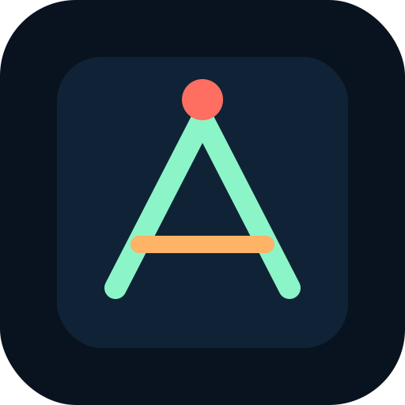

<div align="center">
  <h1>Dodge60</h1>
  <p>One minute of clean panic. Dodge the fall, survive the clock.</p>
  
  <p>
    
    
    
  </p>
  <p>
    <a href="./README.md">
      
    </a>
    <a href="./README.ja.md">
      
    </a>
  </p>
</div>

## Live URL

- Pages: `https://onizuka-agi-co.github.io/onigame-dodge60/`

## Overview

Dodge60 is a tiny static survival game built for GitHub Pages.
Move the square, avoid the falling blocks, and hold out for a full minute.

## Controls

- Desktop: `Arrow keys` or `WASD`
- Mobile: drag your finger on the stage
- Retry: click the button or press `Space` after a game over

## Local Usage

Open `index.html` directly, or run a simple static server:

```bash
python -m http.server 8080
```

Then open `http://localhost:8080/`.

## Structure

```text
onigame-dodge60/
|- assets/
|  `- repo-mark.svg
|- index.html
|- styles.css
|- app.js
|- README.md
`- README.ja.md
```

## Deployment

This repo is designed to publish directly from the repository root on GitHub Pages.
